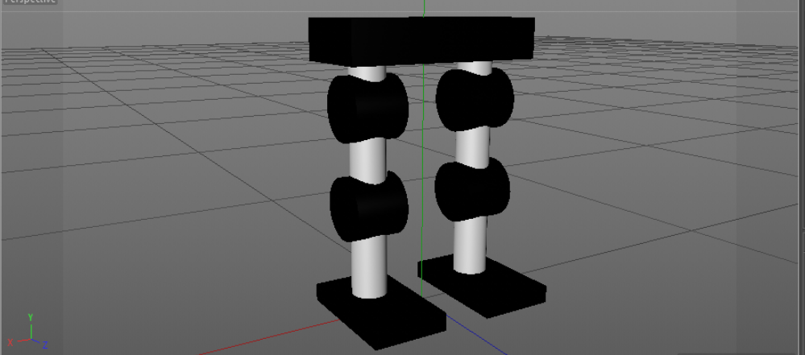
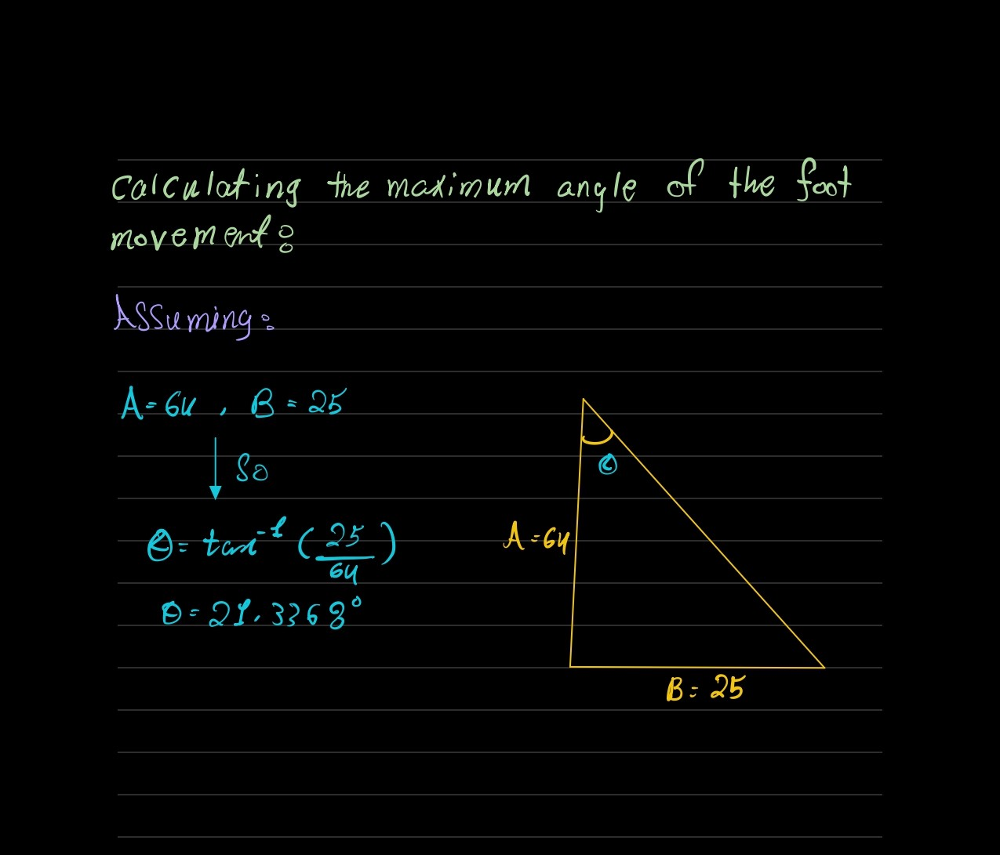

# Mech-Eng first & second Tasks 🗣:  

## Task 1: Robot legs stick model🦿

The initial robot legs stick model was designed using Cinema 4D.

### The model parts heights::
- Model Height: 64 cm.
- Base Height: 9 cm.
- Legs: 51 cm.
- Feet: 4 cm.

### Result:

## Task 2: Maximum degree of rotation for the robot foot movement 🧮

The calculation done by using the rule bellow:

`Theta = tan^-1 * (adjacent /  opposite)`

### Result:

 
